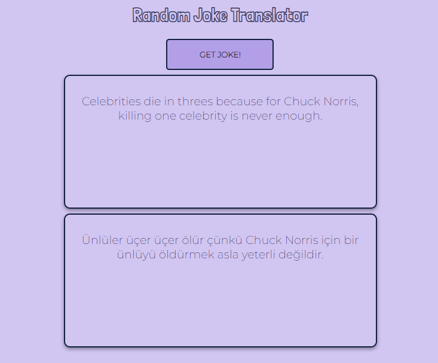

# random-joke-translator-with-module

## Random Joke Translator Project

It is an application that uses the Google Translate API to reinforce the module concept in Javascript, as well as to make random jokes and to translate the jokes into Turkish.
To use this application, after downloading the files, you must enter your own API Key instead of ${API_KEY} in translate.js.


### Tech stack
```
- HTML,CSS
- Javascript
- Javacript Modules
- Google API
```

## Preview 

 

 
